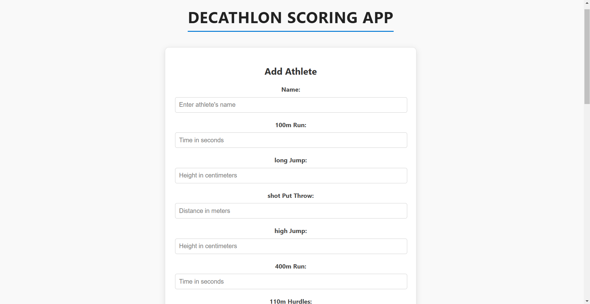
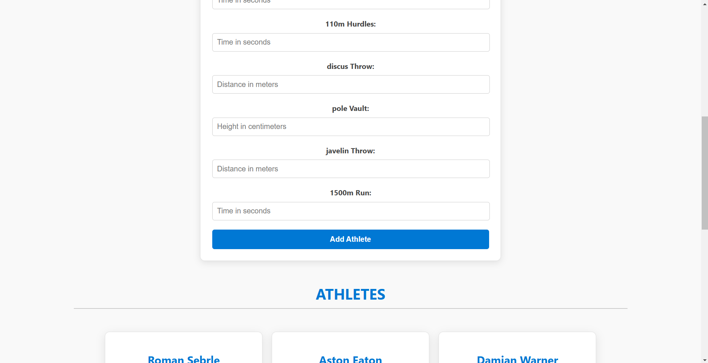
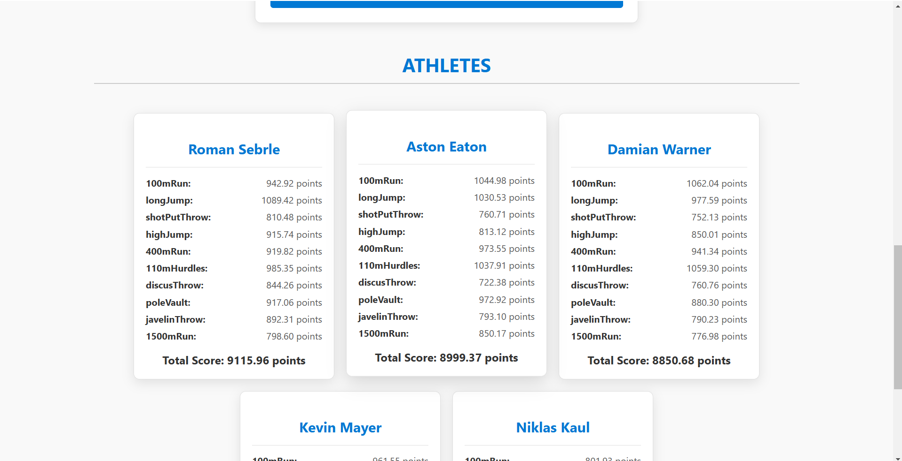
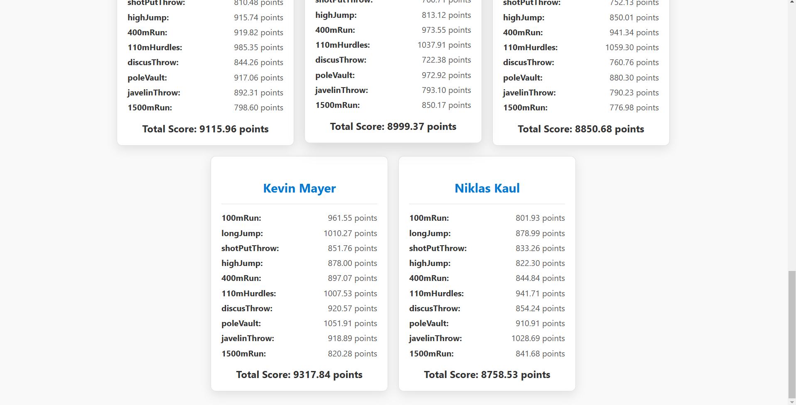

# Decathlon-app
A dynamic web application to calculate decathlon scores for athletes based on their performance in ten events. This project implements official decathlon scoring algorithms and provides an intuitive, responsive user interface for data entry and results.


## Features
- Athlete Management: Add, view, and manage athlete details.
- Real-time Scoring: Automatically calculates scores for each event and total score based on official decathlon rules.
- Responsive Design: Optimized for desktop and mobile views.
- Error Handling: Displays meaningful error messages for invalid inputs.


## Setup Instructions

### Prerequisites
- Node.js and npm installed on your system.
- A backend server running to handle API requests (example: `http://localhost:5000/api/athletes`).

### Steps to Run Locally
1. Clone the Repository:
   ```bash
   git clone https://github.com/mohanbhogavarapu07/Decathlon-app.git
   cd Decathlon-Scoring-App
   ```
2. ```bash
   cd node-backend
   npm install
   node server.js
   ```

3. Install Dependencies:
   ```bash
   cd ..
   cd react-frontend
   npm install
   ```

3. Start the Application:
   ```bash
   npm start
   ```
   The app will be available at `http://localhost:3000`.
4. If error occurs to start the application use this commands
   ```bash
   npm install --save-dev webpack@latest webpack-cli@latest react-scripts@latest
   npm start
   ```

## Key Features
1. Accurate Event Scoring: Implements the decathlon scoring formulas for all ten events.
2. Interactive Form: Simple and clean interface for entering athlete performance metrics.
3. Real-Time Feedback: Instant score calculations and updates.
4. Responsive Layout: Ensures seamless experience on devices of all sizes.
5. Smooth Animations: Cards and forms transition elegantly.


## Screenshots

### 1. Home Screen


### 2. Adding an Athlete


### 3. Score Card


### 4. Score Card


## Demo Video

[Watch the Demo Video](https://vimeo.com/1054951670/68c48bd1c0?share=copy)

## Technologies Used
- Frontend: React, CSS (with responsive design principles).
- Backend: Node.js (API server for handling athlete data).
- Libraries:
  - Axios: For API requests.
  - React Hooks: State management.


## Future Enhancements
1. User Authentication: Secure login and personalized athlete tracking.
2. Export Functionality: Download results as PDF or Excel.
3. Performance Analytics: Provide insights and trends for athletes over time.


## Acknowledgments
- Scoring formulas are based on official decathlon scoring rules.

## Contact
- Email: narayana.bhogavarapu@sasi.ac.in
- LinkedIn: [Your LinkedIn Profile](www.linkedin.com/in/mohan-bhogavarapu)

